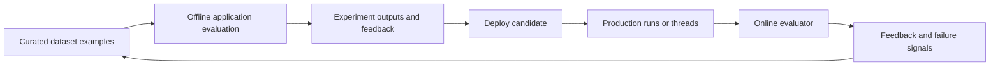

## Scope and navigation

The repository presents LangSmith evaluation as a development lifecycle: establish quality criteria, test candidate application changes against curated data before deployment, then monitor production traces and feed discovered failures back into the test set. In the site navigation, the `Test` area introduces this domain through `langsmith/evaluation`, `evaluation-quickstart`, `evaluation-concepts`, and `evaluation-approaches`; detailed dataset, experiment, and scoring pages sit below it.

This page is a maintainer map, not a substitute for the task guides. Keep the distinction between **when/what is evaluated** and **how an evaluator is implemented** clear:

| Concern | Primary documentation | Boundary to preserve when editing |
|---|---|---|
| Concepts, targets, lifecycle, feedback shape | `src/langsmith/evaluation-concepts.mdx` | Defines offline vs online targets and shared terminology. |
| Evaluation purpose and implementation matrix | `src/langsmith/evaluation-types.mdx` | Separates benchmarking, tests, backtesting, and monitoring from evaluator mechanisms. |
| Dataset execution and experiment-wide binding | `src/langsmith/bind-evaluator-to-dataset.mdx` | Covers automatic grading of *new* experiments after an evaluator is attached. |
| Workspace evaluator lifecycle and attachment settings | `src/langsmith/evaluators.mdx`, `manage-evaluators-sdk.mdx` | Owns reusable evaluator management, retention, stats, chaining, and deletion rules. |
| LLM judge authoring | `src/langsmith/llm-as-judge.mdx`, `llm-as-judge-sdk.mdx` | UI and SDK flows both apply to offline evaluation; the online setup is separate. |
| Production run and thread evaluation | `src/langsmith/online-evaluations-llm-as-judge.mdx`, `online-evaluations-multi-turn.mdx` | Owns online filters, sampling, backfill, and thread-specific lifecycle. |
| Decision-model judge authoring and providers | `src/langsmith/decision-model-evaluator.mdx`, `online-evaluations-decision-models.mdx`, `typesafe-compatible-model.mdx` | UI-only evaluator configuration, typed questions, model/provider constraints, and compatible endpoint setup. |

## Evaluation model

### Offline: dataset → experiment → feedback

Offline evaluation is pre-deployment work: benchmarking alternatives, unit and regression checks, and backtesting. A dataset contains examples: input dictionaries plus optional reference-output and metadata dictionaries. Running an application version over those examples produces an experiment, which records per-example outputs, evaluation scores, and execution traces. Because an example can supply expected output, offline evaluators can make reference-based correctness comparisons; they can also perform reference-free checks.

The SDK route is client-side: provide a target function, a dataset, and evaluator functions to `evaluate()` (or `aevaluate()`). An evaluator can receive selected `inputs`, `outputs`, and `reference_outputs`, or the fuller `run` and `example` objects. UI-bound evaluators are server-side: attaching one to a dataset automatically runs it alongside SDK-supplied evaluators for experiments created after attachment; it does not retroactively grade already-created experiment runs.

### Online: tracing project → runs or threads → feedback

Online evaluation is production monitoring on traces with no reference outputs. Attach an evaluator to a tracing project and it can evaluate matching incoming runs, or—when configured for thread source—an entire conversation. Therefore online criteria should be reference-free: quality patterns, safety, format, heuristics, and operational anomalies rather than ground-truth answer comparison.

Run-level rules can be filtered using the trace filter builder, sampled to constrain work and cost, and backfilled only at rule creation. Backfills are background jobs and logs expose their progress. A thread evaluator has a different completion boundary: it waits for the project's configured idle period, assembles and de-duplicates the thread's message history, then scores once for the completed thread. Thread evaluation requires a shared thread ID and top-level `messages` lists in the trace inputs and outputs; without that tracing shape it cannot work.

*Offline experiments validate curated examples before deployment; online feedback from production traces supplies candidates that refine the dataset for the next evaluation cycle.*

## Evaluators: shared definitions, local attachments

An evaluator is a **workspace-level** resource. One definition can be attached to multiple datasets and tracing projects, avoiding duplicated scoring logic. The definition controls its prompt/code and feedback configuration; the attachment controls the context in which it runs. Consequently, edits to a shared evaluator apply across every attached dataset and project, while sampling, filters, and evaluator spend limits are configured per attachment.

Evaluators return feedback. A feedback item has a metric `key`, a numerical `score` or categorical `value`, and an optional `comment`. For an LLM-as-a-judge UI evaluator, each top-level field in the structured-output schema becomes a distinct feedback item. Workspace evaluator views expose the definition, traces, logs, and current attachments; an evaluator must be detached from every project and dataset before deletion.

For online attachments, scoring a trace may extend its retention and affect pricing. When a project's default is base retention, the UI allows an attachment to opt out of extending retention; the choice affects only subsequently scored traces. Run-level attachments can request extended feedback, cost, and token statistics only when their logic needs them. Those stats enable evaluator chaining: filter a second evaluator on a previously created feedback key, then read the resulting average from `run["feedback_stats"]`. The dependency is on the key, not on which evaluator produced it.

### Implementation choices and supported surfaces

| Implementation | Offline | Online | UI / SDK boundary |
|---|---|---|---|
| Code | Deterministic rules, including reference-output checks | Inline Python or JavaScript over a `Run` | UI and SDK support offline; UI supports online. Online code has no internet access and only the documented standard/public packages. |
| LLM-as-a-judge | Prompt maps example/run fields, optionally including a reference | Prompt maps production run or thread fields | UI and SDK support offline authoring/execution; UI configures online evaluators. A UI judge has a prompt, model, variable mapping, and structured feedback configuration. |
| Decision model | Typed questions can use input, output, and reference output in state | Typed questions use run or thread state | **UI only** for creating decision-model evaluators; LangSmith SDKs do not support their creation. |
| Composite / summary / pairwise | Composite and pairwise compare or combine scores; summary calculates experiment-wide metrics | Composite is supported on a tracing project | Keep their dedicated pages authoritative for aggregation and comparison semantics. |

## Attachments and multimodal evaluation

Dataset examples may carry binary attachments such as images, audio, and documents. Attachments are preferable to base64 for transfer efficiency and UI visualization. They can be selectively propagated from a run when creating an example, or created directly in the UI or SDK. In UI dataset editing, an attachment is limited to 20 MB and changes are not persisted until submission.

An evaluator can map a named attachment with `{{attachment.file_name}}` or the full collection with `{{attachments}}`. A multimodal judge must use a model supporting both the input modality and structured output; the inspected guide states that audio is currently Gemini-only, while images and PDFs require a vision-capable model returning structured output. SDK target/evaluator functions receive attachment metadata and access differently by language: Python receives an attachment reader and presigned URL, while TypeScript receives presigned URL and MIME type through the configuration object when attachments are included. Treat that interface distinction as part of the implementation contract rather than assuming raw bytes are universally available.

Online LLM judges can also reference base64 multimodal content from traced fields or attachments already logged with the trace. This is an online evaluator mapping concern, not evidence that every evaluator type can consume arbitrary attachment content.

## Decision-model boundaries

Decision-model evaluators replace an LLM prompt/output-schema contract with a mapped **state** and typed grading questions. Put the evaluated context in state and the criteria in questions—state must not carry grading instructions. Each unique question name becomes a feedback key:

- **Noul** produces a `score` probability from 0 to 1.
- **Choice** produces a categorical `value` equal to the selected option name.
- **Score** produces a numerical `score` from 0 through the highest level index.

The documentation supports SemIf through LangSmith Gateway and Jev through TypeSafe; Jev requires a TypeSafe API key stored as a workspace secret, defaulting to `TYPESAFE_API_KEY`. SemIf availability is limited to US organizations on the stated Free, Developer, and Plus plans. The provider warning is material: TypeSafe does not offer zero data retention, so it may retain evaluator prompts and outputs.

A saved TypeSafe-compatible model configuration is the extension point for a server implementing the TypeSafe System One API, including a self-hosted model or another provider. It contains model ID, workspace-secret name, and Base URL; LangSmith appends `/v1/systemone`, so that path must not be placed in the configured Base URL. Decision-model evaluators cannot load Prompt Hub prompts, use a custom output schema, or use few-shot examples. Preserve these explicit limitations and do not generalize LLM-judge SDK or prompt features to this evaluator type.

Question limits are provider-specific. SemIf accepts at most 32 questions; both providers permit 2–10 score levels, while Jev accepts 2–255 choice options and SemIf 2–16. The model's full answer is retained in feedback source metadata under `typesafe`; standard feedback behavior then permits filtering, charts, alerts, and automations.

## Safe documentation changes

1. Start with `evaluation-concepts.mdx` for terms and the offline/online boundary, then edit the narrow implementation or operational page that owns the behavior. Do not move UI steps, retention rules, provider requirements, or SDK support claims into conceptual prose without preserving their source-specific qualifiers.
2. Use the UI/SDK matrix above as a negative check. In particular, “SDK does not support decision model evaluators yet” means evaluator creation is UI-only; it does not prohibit calling a decision model directly through the LLM Gateway.
3. Treat attachment modality requirements, provider retention, spend limits, sampling, filters, and background backfills as operational constraints, not generic product promises. Keep their scope—dataset versus tracing project, run versus thread, and creation-time versus future behavior—explicit.
4. When documenting test strategy, distinguish hard pass/fail testing from evaluation metrics: metrics may be subjective and comparative, but teams can turn a regression threshold into a test and run it in ordinary tools such as pytest or Vitest/Jest.
