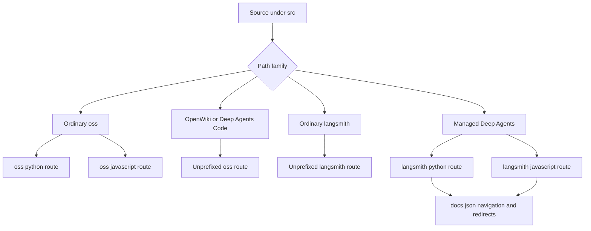
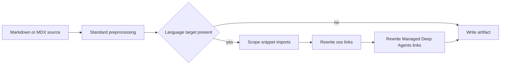

# Versioned Documentation and Routes

`DocumentationBuilder` derives public documentation routes from source paths under `src/`. It emits language variants where a page is shared by Python and JavaScript readers, and retains a single route where a product is intentionally language-agnostic. `src/docs.json` is a separate navigation and redirect contract: its page entries must name generated routes, but a navigation label does not determine a source file's ownership.

## Choose the source family

| Source family | Output routes | Target used for preprocessing |
| --- | --- | --- |
| Ordinary `src/oss/` content outside the language-agnostic `deepagents/code/` and `openwiki/` roots, including LangChain, LangGraph, and other Deep Agents pages | `/oss/python/...` and `/oss/javascript/...` | `python` and `js` respectively |
| `src/oss/python/...` or `src/oss/javascript/...` | Only the matching output family, without the source-language path component | Matching target only |
| `src/oss/deepagents/code/...` | `/oss/deepagents/code/...` | `python` fallback |
| `src/oss/openwiki/...` | `/oss/openwiki/...` | `python` fallback |
| Ordinary `src/langsmith/...` | `/langsmith/...` | `python` fallback |
| Direct `src/langsmith/managed-deep-agents*.mdx` | `/langsmith/python/...` and `/langsmith/javascript/...` | `python` and `js` respectively |

This diagram shows route branching by source path. Navigation grouping is configured afterwards and must not be used to infer the source family.

## Build lifecycle and routing rules

A full `build_all()` first deletes `build/`, then builds ordinary OSS for Python and JavaScript, the two unversioned OSS products, ordinary LangSmith content, and Managed Deep Agents variants. It then copies shared files and npm snippets and generates the `llms.txt` artifacts. Removing the output tree prevents a full build from leaving stale route artifacts behind.

`build_file()` applies the same routing policy to an individual existing file. An ordinary OSS file produces two artifacts, except for the two unversioned product roots. An ordinary LangSmith file builds once, while a Managed Deep Agents file builds twice. Root-level and shared files copy once. Building a missing file is a programming error and raises `AssertionError`.

For ordinary OSS, language-specific source directories are a filter rather than a route segment. During a Python pass, `src/oss/javascript/...` is skipped; during a JavaScript pass, `src/oss/python/...` is skipped. The selected directory name is removed before output, so `src/oss/python/concepts/example.mdx` emits at `/oss/python/concepts/example` rather than a doubled language path.

Ordinary LangSmith documents are emitted once below `/langsmith/`, excluding Managed Deep Agents documents, and are processed with the Python target. This is a preprocessing default, not a claim that every ordinary LangSmith page is Python documentation.

## Transform one emitted page

For Markdown and MDX, the builder first runs standard preprocessing. For a language-targeted output, it then scopes Markdown snippet imports, rewrites OSS links, and rewrites Managed Deep Agents links. The builder maps its internal `js` target to `javascript` in public paths. A `.md` input is written as `.mdx`.

This diagram shows the transform order for a generated Markdown artifact.

Use `:::python` and `:::js` fences only for content that genuinely differs by target. The conditional renderer keeps the matching block content without its fences and removes a nonmatching supported block. Escaped `\:::` becomes literal `:::`, while unsupported labels and unclosed blocks remain unchanged. It uses a regex and is not code-fence-aware, so escape literal conditional markers instead of assuming a Markdown code fence protects them.

An unqualified absolute OSS link such as `/oss/langgraph/overview` becomes `/oss/python/langgraph/overview` or `/oss/javascript/langgraph/overview` in a language-targeted build. The rewrite deliberately skips image URLs, already-prefixed URLs, and the language-agnostic Deep Agents Code and OpenWiki roots. In versioned MDX, an import from `/snippets/component.mdx` is similarly scoped to `/snippets/python/component.mdx` or `/snippets/javascript/component.mdx`; an already scoped import is left intact.

## Keep language-agnostic products unprefixed

Deep Agents Code and OpenWiki are explicit exceptions to the normal OSS split. Each is emitted once at its own unprefixed route root, and the Python branch is used only as the deterministic conditional-rendering fallback. Consequently, links within either root remain unprefixed, while an unqualified link from one of these pages to ordinary OSS is rendered to the Python OSS route.

OpenWiki appears in both the Python and TypeScript Build dropdowns using the same `/oss/openwiki/...` paths. The client-side language toggle hides itself for the OpenWiki route family because no corresponding language variant exists. Deep Agents Code is likewise unversioned at `/oss/deepagents/code/...`, regardless of where its navigation tab appears.

## Managed Deep Agents: emit variants, author bare links

Managed Deep Agents is the LangSmith exception. A direct file immediately under `src/langsmith/` whose basename starts with `managed-deep-agents` and whose extension is `.md` or `.mdx` is classified as language-variant content. It does not produce an unversioned page; its Python and JavaScript artifacts each receive their own conditional content, language-scoped snippet imports, OSS links, and Managed Deep Agents links.

The source pages deliberately use bare internal Managed Deep Agents URLs such as `/langsmith/managed-deep-agents-channels-slack` in Markdown links and quoted `href` attributes. For **every language-targeted Markdown artifact**, the final rewrite changes a bare `/langsmith/managed-deep-agents...` URL to `/langsmith/python/managed-deep-agents...` or `/langsmith/javascript/managed-deep-agents...`. Already-prefixed URLs do not match this rewrite. This makes a single source page's cross-links and cards stay within its emitted language family; it also means an ordinary LangSmith page, built with the Python target, resolves a bare Managed Deep Agents link to Python.

The full-build discovery pass selects only `managed-deep-agents*.mdx`. Although an individual `.md` file matches the classifier and can be built directly, it is absent from the bulk pass. Use `.mdx` for Managed Deep Agents pages.

### Navigation and legacy URL contract

`docs.json` exposes separate **Managed Deep Agents** tabs in the Python and TypeScript Build dropdowns. Both list the expanded family under matching language prefixes: Get started; Agent capabilities, including the nested Channels pages; and Build and deploy. Add a new page to both tabs with the same suffix as its emitted artifact, or navigation will diverge from the route family.

No generated page occupies an unversioned `/langsmith/managed-deep-agents...` route. `docs.json` redirects unversioned current paths—including overview, quickstart, channels, deploy, and many other capability and build pages—to the Python variant, and also redirects historical names such as `managed-deep-agents-invoke`, `-sdk`, and older connector paths to their current Python destination. These redirects preserve existing inbound URLs while choosing Python as the legacy default; they are not replacements for the JavaScript navigation or emitted JavaScript routes.

When adding or moving a Managed Deep Agents page:

1. Place an `.mdx` file directly in `src/langsmith/` and retain the `managed-deep-agents` filename prefix.
2. Author internal family links as bare `/langsmith/managed-deep-agents...` URLs when they should follow the reader's language; the builder will rewrite them. Use an already-prefixed URL only when intentionally pinning a destination language.
3. Add matching entries to both Managed Deep Agents tabs in `src/docs.json`.
4. Add or update an unversioned-to-Python redirect when the route is public, renamed, or replacing a legacy path.
5. Run a full build and inspect both emitted variants, including links, conditional blocks, and snippet imports.

## Verify route changes

The builder regression tests cover unversioned Deep Agents Code and OpenWiki output and their link behavior, language-scoped snippet imports, and Managed Deep Agents dual output. The Managed Deep Agents fixture verifies target-specific links and conditional snippet content, including that unversioned artifacts are not emitted. Dedicated unit tests also cover bare Managed Deep Agents link rewriting in Markdown and quoted `href` attributes.

For a route change, edit source content rather than `build/`, choose the source family before adding navigation, and run a full build when removing or moving pages. Then inspect both generated language variants where applicable and check that `docs.json` navigation and redirects name the routes that the builder actually produces.

## See also

- [Source map](/openwiki/architecture/source-map.md)
- [Preprocessing](/openwiki/concepts/preprocessing.md)
- [Adding pages](/openwiki/operations/adding-pages.md)
- [Builder tests](/openwiki/testing/builder-tests.md)
- [Writing versioned content](/openwiki/workflows/versioned-content.md)
