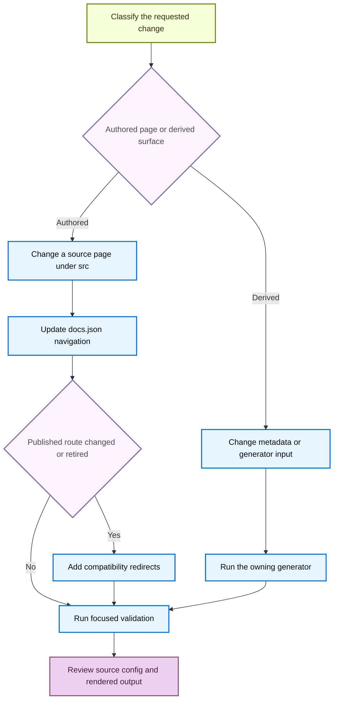

# Adding and Maintaining Documentation Pages

A documentation change is complete only when its owning input, public route, navigation, and validation are correct. `AGENTS.md` is the active authoring guide, and `CLAUDE.md` directs readers to it. Make manual content changes under `src/`, never in `build/`: every build clears and recreates `build/`. Likewise, do not hand-edit generated snippets, integration tables, transformed OpenAPI specifications, or Mintlify-generated endpoint pages. Change the owned input, run its generator, and review the result.

Every new authored page needs an explicit `src/docs.json` navigation entry. A move or retirement is a separate compatibility decision: retain each published route with a redirect to the closest maintained destination.



This flow separates durable source changes from regeneration and makes route compatibility explicit.

## Select the source owner and route family

Choose a source directory by subject ownership, not by the navigation label. Build, for example, mixes OSS and LangSmith sources, and `src/langsmith/fleet/` appears as **No-code agents**. The builder produces these route families:

| Content | Authored source | Emitted routes |
| --- | --- | --- |
| Shared OSS content, including LangChain, LangGraph, and most Deep Agents | `src/oss/` outside language-specific directories | One source builds at both `/oss/python/...` and `/oss/javascript/...`. |
| Language-specific OSS content, including integrations | `src/oss/python/` or `src/oss/javascript/` | Only the matching language route. |
| OpenWiki and Deep Agents Code | `src/oss/openwiki/` or `src/oss/deepagents/code/` | One unversioned route: `/oss/openwiki/...` or `/oss/deepagents/code/...`. |
| Ordinary LangSmith content | `src/langsmith/` | One unversioned `/langsmith/...` route. |
| Managed Deep Agents | Direct `src/langsmith/managed-deep-agents*.mdx` files | Both `/langsmith/python/...` and `/langsmith/javascript/...` routes. |

Shared OSS pages use one source file and may use `:::python` and `:::js` fences. Preprocessing retains the matching block, resolves cross-references in that language, rewrites supported snippet imports, and rewrites ordinary root-relative `/oss/...` links to the target language. Do not manually insert `/python/` or `/javascript/` into ordinary shared OSS links.

OpenWiki and Deep Agents Code deliberately remain unversioned. From versioned OSS content, link to `/oss/openwiki/...` or `/oss/deepagents/code/...` without a language segment. The builder skips those paths during OSS link rewriting, and their conditional fences resolve as Python.

Managed Deep Agents is different from ordinary LangSmith content. The builder excludes direct Managed Deep Agents source files from ordinary unversioned output and emits language variants. Source links may use an unversioned `/langsmith/managed-deep-agents...` route when a language build should select the corresponding variant; the builder rewrites it for Python or JavaScript. Existing unversioned public routes are compatibility aliases in `docs.json` that redirect to Python routes. Do not restore a duplicate unversioned source page.

## Add an authored page to navigation

`src/docs.json` is the route and navigation authority. Its current top-level shape is `navigation.products[]`, whose products have `menu[]` items. A menu item can contain direct `pages`, `tabs`, `groups`, or, for Build, `dropdowns[]` containing `tabs[]`. Each `pages` array can hold route strings and nested `{ "group": ..., "pages": [...] }` objects. Find the neighboring route in the intended array and mirror its structure; do not assume every page follows a product → tab → group chain.

For an authored page:

1. Inspect a neighboring source page and create the `.md` or `.mdx` file under the selected `src/` owner. Give it required frontmatter and keep `description` plain text, because Markdown breaks SEO.
2. Add an extensionless route relative to `src` to the exact `pages` array. For example, `src/langsmith/sandboxes.mdx` becomes `langsmith/sandboxes`.
3. Add every route emitted by the selected owner: shared OSS pages need Python and TypeScript navigation entries; a language-specific page has one; OpenWiki and Deep Agents Code have one unversioned entry; and a Managed Deep Agents page needs an entry in each language dropdown.
4. For a new nested group, put its index route first when the group has an index. For an integration in an existing component, add the page to that component's `index.mdx`; change `docs.json` only for a new component group.
5. Before renaming a heading, search for inbound fragment links because changing the heading changes its generated anchor.

### Place LangSmith evaluation pages deliberately

Ordinary LangSmith evaluation documentation remains unversioned: author it in `src/langsmith/` and add its `langsmith/...` route to the Test menu. The existing evaluation overview and concepts pages are in **Test** → **Get started**. Evaluator setup pages belong in **Test** → **Evaluators**; the decision model evaluator is specifically nested under **Evaluator types** → **UI**. Follow this nearby placement rather than treating an evaluation page as an OSS language-versioned page.

The removed-pages checker recursively reads direct pages, tabs, dropdown tabs, and groups. It requires every configured navigation route to resolve to a source `.mdx` or `.md` file. For `/oss/python/` and `/oss/javascript/` routes, it also accepts the corresponding shared `src/oss/` source.

## Move or retire a page safely

Use the mover for the filesystem operation, then update navigation and make the public-route decision yourself. Begin with a preview:

```bash
uv run docs mv src/langsmith/evaluation.mdx src/langsmith/deploy/evaluation.mdx --dry-run
```

The installed `docs` console script routes to `pipeline.cli:main`. Its mover scans Markdown, MDX, and notebook Markdown cells below `src/` for links that resolve to the moved file. When the parent directory changes, it also recalculates relative links inside the moved document. `--dry-run` reports prospective rewrites without moving or editing files. A real run appends the move to `link_changes.jsonl`, relocates the source, and then updates internal relative links.

After reviewing the preview:

1. Run the move without `--dry-run`.
2. Change the affected route strings in their actual `docs.json` `pages` arrays and search for root-relative uses of the old public URL. The mover handles file-resolved links, not navigation or compatibility work.
3. Add a redirect for every public route that moved or retired. Shared OSS and Managed Deep Agents commonly require a redirect for each language route.

```json
{
  "source": "/langsmith/evaluation",
  "destination": "/langsmith/deploy/evaluation"
}
```

Redirects belong in the top-level `redirects` array and use site paths. The checker compares base and proposed navigation. If a removed navigation route's source no longer exists, it requires an exact redirect source or a covering `:path*` wildcard. Retaining a source file bypasses that narrow check, but does not by itself preserve a published URL intentionally.

### Preserve Managed Deep Agents compatibility

Treat a Managed Deep Agents move as a two-language route change plus an old unversioned compatibility surface. Its pages appear in the Python and TypeScript Build dropdowns under `langsmith/python/managed-deep-agents-*` and `langsmith/javascript/managed-deep-agents-*`. The existing `redirects` array maps legacy unversioned routes to matching Python pages. Preserve or replace that compatibility redirect when changing one of these pages, then add redirects for changed Python and JavaScript public routes.

Run the structural check whenever navigation or redirects change:

```bash
python3 scripts/check_removed_pages_redirects.py --base-ref origin/main src/docs.json
```

## Regenerate derived surfaces through their inputs

Generated content has an owner. Edit source metadata or generator input, run the owning command, and review the resulting change rather than modifying the derivative.

### Reusable snippets and testable samples

Put reusable MDX in `src/snippets/` and import it using `from '/snippets/...'`. The builder recognizes and rewrites that import into a language-specific copy for versioned pages; Mintlify's `<Snippet file="..." />` form is not rewritten.

Author runnable examples in `src/code-samples/`. Test a changed sample and regenerate its extracted and rendered forms:

```bash
make test-code-samples FILES="src/code-samples/path/to/sample.py"
make code-snippets
```

The extraction pipeline creates intermediate content under `src/code-samples-generated/` and MDX under `src/snippets/code-samples/`. Do not hand-edit either output.

### Integration listings

Integration component-table snippets are generated from `integration:` frontmatter on hosted integration guides and external records in `scripts/data/integration_external_docs.yaml`. A component index imports its derived downloads snippet, so adding a hosted integration with suitable frontmatter can change the shared listing. External rows use `docs_url`; the refresh script permits only `https://`, `http://`, or a single-slash site-relative URL before rendering links.

```bash
uv run python scripts/refresh_integration_downloads.py --check-docs-urls
uv run python scripts/refresh_integration_downloads.py --write
```

### OpenAPI references

An `openapi` navigation object configures Mintlify-generated endpoint pages, not authored endpoint MDX. For example, the LangSmith REST API group names `langsmith/langsmith-platform-openapi.json` as its source and `langsmith/smith-api` as its generated directory. Do not add, move, or hand-edit generated endpoints as if they were authored pages.

The LangSmith OpenAPI processor fetches its default input only from the allow-listed `api.smith.langchain.com` host. It hides selected operations, normalizes operation titles, assigns and orders sidebar tag groups, and writes the transformed specification only with `--write`.

```bash
uv run python scripts/process_langsmith_openapi.py --write
make check-openapi
```

`make check-openapi` builds first and validates `langsmith/agent-server-openapi.json` in `build/`. It does not validate every configured OpenAPI source, so use the relevant generator and inspect the configured navigation when changing the LangSmith platform specification.

## Validate the change

Run focused checks for the owner you changed, then render and check routes where applicable:

1. Run `make lint_prose FILES="src/path/to/page.mdx"`; omit `FILES` to lint all of `src/`.
2. Run `make check-cross-refs` after changing `@[...]` references.
3. Run the relevant sample, generator, integration URL, or OpenAPI check after changing a generator input.
4. Use `make dev` to inspect the rendered result. It performs an initial build, watches `src/`, and serves `build/` with `mint dev` on port 3000. Inspect both language outputs for shared OSS and Managed Deep Agents pages.
5. Run `make build` for clean output. After route or link changes, run `make broken-links`; after fragment changes, run `make broken-links-with-anchors`. Both ask Mint to validate redirects and links, filter expected deployment-time OpenAPI and standalone-snippet reports, then fail on remaining broken-link output.
6. Review authored source, `src/docs.json`, generator inputs, and generated output. A `build/` diff is validation evidence, not the durable edit.

## Completion checklist

- [ ] The change was made in an authored owner or generator input, never a generated output.
- [ ] Every new authored page has valid frontmatter with a plain-text description and an explicit entry in the correct `docs.json` navigation array.
- [ ] Navigation includes every route emitted by the selected route family.
- [ ] Each moved or retired public URL, including applicable Managed Deep Agents aliases, redirects to a maintained destination.
- [ ] Snippets, samples, integration listings, and OpenAPI surfaces were regenerated from their owners.
- [ ] Focused lint, cross-reference, generator, build, and link checks ran where applicable.
- [ ] Rendered output and the final source/configuration diff were reviewed.

## See also

- [Source directory map](/openwiki/architecture/source-map.md)
- [LangSmith evaluation](/openwiki/concepts/langsmith-evaluation.md)
- [Versioning](/openwiki/concepts/versioning.md)
- [Mintlify integration](/openwiki/integrations/mintlify.md)
- [Test overview](/openwiki/testing/test-overview.md)
- [Versioned content](/openwiki/workflows/versioned-content.md)
