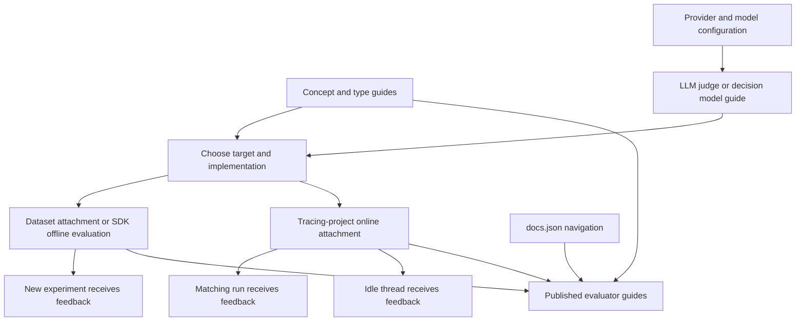

# Changing LangSmith Evaluator Documentation

Evaluator documentation is a connected product surface, not a set of interchangeable setup pages. Keep the owning guide narrow and reconcile claims across the neighboring guides whenever a capability, configuration option, or link changes. In particular, distinguish the **evaluation target** (dataset examples versus production runs or threads), the **evaluator implementation** (code, LLM judge, or decision model), and the **configuration surface** (UI versus SDK).

This workflow covers the authored LangSmith sources in `src/langsmith/`. They emit one unversioned `/langsmith/...` route family; the `Test` navigation separates the **Evaluators** tab from the `Observe` tab's **Online evaluators** group. Edit source files rather than `build/`, and treat `src/docs.json` as the independent owner of navigation.

## Start with the ownership map

Use the following map to decide which pages must be read and reconciled. It prevents, for example, an offline authoring guide from accidentally promising online behavior or an SDK guide from implying decision-model support.

| Change concerns | Primary owner | Required neighboring checks |
| --- | --- | --- |
| Terminology, lifecycle, targets, and feedback | `evaluation-concepts.mdx` | `evaluation-types.mdx` for the why/when versus how distinction. |
| Evaluator resource lifecycle, attachments, retention, extended stats, and deletion | `evaluators.mdx` | Online setup pages when an attachment setting changes. |
| Automatic grading of SDK-created experiments | `bind-evaluator-to-dataset.mdx` | `llm-as-judge.mdx` and `decision-model-evaluator.mdx` for compatible authoring. |
| Offline LLM judge configuration in the UI | `llm-as-judge.mdx` | `create-few-shot-evaluators.mdx`; do not merge in online rules. |
| Programmatic offline LLM judging | `llm-as-judge-sdk.mdx` | `manage-evaluators-sdk.mdx` when changing persistent evaluator management. |
| Run-level production judging | `online-evaluations-llm-as-judge.mdx` | `online-evaluations-multi-turn.mdx` for thread semantics and `evaluators.mdx` for shared settings. |
| Decision-model questions and provider choice | `decision-model-evaluator.mdx` | `online-evaluations-decision-models.mdx` and `typesafe-compatible-model.mdx`. |

`src/docs.json` places the general evaluator pages—including dataset binding, UI evaluator types, and SDK evaluator types—in **Test → Evaluators**. It places run, decision-model, and multi-turn setup in **Observe → Online evaluators**. Preserve that distinction in wording and navigation changes; directory adjacency does not determine the public menu.

## The model to preserve

Offline evaluation runs an application over dataset examples and produces experiment outputs, scores, and traces. Examples provide inputs and may provide reference outputs, so reference-based scoring belongs to this path. Online evaluation monitors production traces: run-level evaluators score individual matching runs, while thread-level evaluators score a completed conversation. Production runs do not have reference outputs, so online documentation must frame criteria as reference-free quality, safety, format, or behavioral checks.

Evaluators are workspace-level resources. A single definition can attach to multiple datasets and tracing projects, whereas filters, sampling, spend limits, and online retention behavior are attachment-specific. An edit to a shared evaluator affects every attachment, and deletion requires detaching it everywhere. Keep that lifecycle statement synchronized between the concepts and management guides.



*Evaluator documentation connects shared concepts, implementation-specific configuration, offline experiment execution, online run or thread execution, and Mintlify navigation without treating them as the same capability.*

## Reconcile the implementation and interface matrix

Before modifying a claim, check the matrix rather than extrapolating from a nearby guide.

| Implementation | Offline | Online | Important boundary |
| --- | --- | --- | --- |
| Code | UI or SDK | UI | Dataset-bound code receives both the experiment `Run` and dataset `Example`, enabling reference-output comparisons. |
| LLM-as-a-judge | UI or SDK | UI configuration | The UI guide owns prompt, model, variable mapping, and structured feedback configuration; the SDK guide owns evaluator/target functions and `evaluate()`. |
| Decision model | UI | UI | SDKs do not create decision-model evaluators. State maps context; typed questions, not state, hold the grading criteria. |
| Composite, summary, pairwise | See their dedicated guides | Only where their dedicated guide says so | Do not infer online support merely because they aggregate evaluator feedback. |

An LLM judge's UI feedback configuration becomes structured output: each top-level schema key becomes separate feedback. Few-shot corrections are an LLM-judge feature with specific constraints: they use the `{{Few-shot examples}}` variable, require mustache prompts, work only for run-level evaluators, and are unavailable to decision models. Keep those limits adjacent to the few-shot guide rather than broadening them to all evaluators.

## Preserve offline dataset-binding semantics

Dataset binding is server-side automation for **new** experiments created through the SDK. It runs configured dataset evaluators in addition to evaluators passed programmatically; it does not retroactively score experiment runs that existed before the binding. This creation-time boundary is a required qualifier in any dataset-attachment change.

For a bound code evaluator, document the two inputs precisely: the experiment `Run` contains application input and output, and the dataset `Example` contains the reference example. Reference outputs may be used for scoring when present. For an LLM judge or decision model, preserve the mapping boundary: offline configuration may map input, output, and reference output, unlike production-only rules.

## Preserve online execution and operational semantics

A run-level online evaluator belongs to a tracing project. Its filter determines eligible runs and its sampling rate applies to that filtered population. Backfill can be selected only when creating the rule, runs as a background job, and its progress is visible through evaluator logs. Do not describe backfill as an immediate or repeatable edit action.

For thread-level documentation, retain its different execution boundary:

- Each turn must be traced with a shared thread ID, and top-level trace inputs and outputs must expose a `messages` list in a supported format.
- After the project-level idle interval, LangSmith assembles and de-duplicates the thread messages, then evaluates once per completed thread rather than once per trace.
- The default idle time is 10 minutes, cannot be below 2 minutes, and applies to every thread-level evaluator and thread automation in that project.
- Use run-level wording for per-trace execution; use thread wording only where the required trace shape and completion lifecycle apply.

Online scoring can affect trace retention and cost. The management guide owns the opt-out: it is available when the project default is base retention and affects subsequently scored traces, not existing ones. Run-level evaluators can optionally fetch extended feedback, token, and cost statistics; thread evaluators cannot. Extended stats enable chaining only after a filter ensures feedback with the required key exists, and the dependency is on the feedback key rather than a particular evaluator.

## Keep decision-model provider setup exact

Decision-model evaluators are UI-only and use a mapped state plus typed questions. A question name becomes a feedback key. Noul maps to a 0–1 `score`, Choice maps to a selected-option `value`, and Score maps to a numeric `score` from zero through the highest level index. State supplies evaluated context and must not contain grading instructions.

The provider documentation has security and availability implications that must not be softened:

- SemIf runs through LangSmith Gateway without a provider key and is limited to US organizations on the documented Free, Developer, and Plus plans.
- Jev uses TypeSafe and needs a workspace secret, defaulting to `TYPESAFE_API_KEY`. TypeSafe does not offer zero data retention and may retain submitted evaluator prompts and outputs.
- A TypeSafe-compatible endpoint is a saved model configuration for a server implementing the TypeSafe System One API. It stores a model ID, workspace-secret name, and Base URL; LangSmith appends `/v1/systemone`, so that suffix must not appear in the configured Base URL.

Preserve model-specific question limits and the explicit non-features: decision-model evaluators cannot load Prompt Hub prompts, use a custom output schema, or use few-shot examples. Do not convert the ability to call a decision model directly through the LLM Gateway into a claim that an SDK can create a decision-model evaluator.

## Change and validation checklist

1. Identify the target and implementation first, then open the owner and every linked guide in the ownership map that repeats the affected capability.
2. Update UI steps only in UI-owned guides and SDK mechanics only in SDK-owned guides. Maintain the explicit UI-only decision-model boundary.
3. For offline changes, verify reference-output and new-experiment scope. For online changes, verify run versus thread scope, filter/sampling/backfill timing, and retention or spend consequences.
4. For provider changes, recheck secret names, availability, retention warning, endpoint path construction, typed feedback mapping, and unsupported features against the decision-model and compatible-endpoint guides.
5. Search inbound links before changing headings or routes. If navigation changes, update `src/docs.json` deliberately: evaluator pages and online evaluator pages have separate public groups.
6. Run focused prose linting, then rebuild and validate links and anchors:

```bash
make lint_prose FILES="src/langsmith/<changed-page>.mdx"
make build
make broken-links-with-anchors
```

`make broken-links-with-anchors` rebuilds first and checks generated links, anchors, and redirect destinations through Mintlify. A build output is validation evidence only; do not edit it.

## Related pages

- [LangSmith evaluation domain](/openwiki/concepts/langsmith-evaluation.md)
- [Source directory map](/openwiki/architecture/source-map.md)
- [Adding and maintaining documentation pages](/openwiki/operations/adding-pages.md)
- [Mintlify integration](/openwiki/integrations/mintlify.md)
- [Testing overview](/openwiki/testing/test-overview.md)
