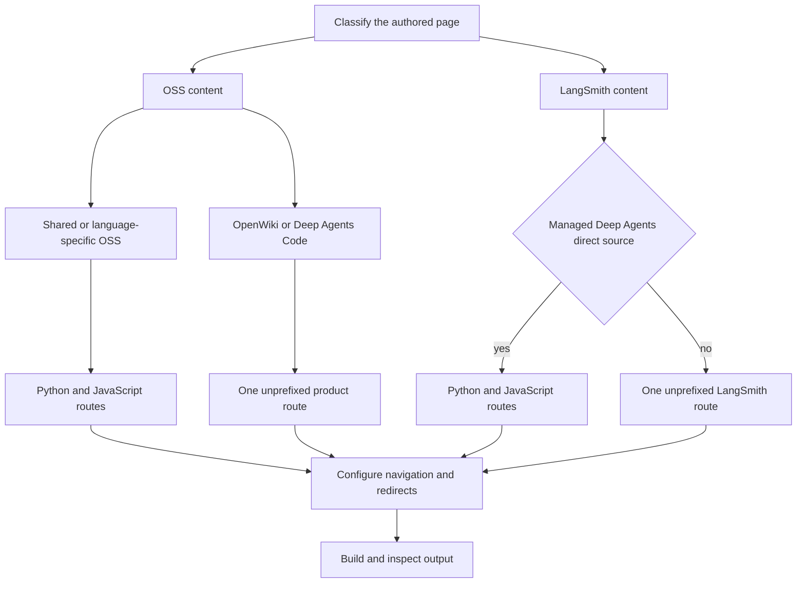

# Changing Versioned Content

Versioned documentation keeps shared prose in one authored source and generates language-specific artifacts where the product needs them. Decide **source ownership**, **generated routes**, and **navigation or redirects** separately. Author under `src/`, never under `build/`: the full build deletes and recreates generated output.



This flow separates the authored location from the output and from how Mintlify exposes that output.

## 1. Classify the source before changing URLs

The builder uses `js` internally and `javascript` in routes.

| Content class | Author in | Builder emits |
| --- | --- | --- |
| Shared OSS page | Most content below `src/oss/` | `/oss/python/...` and `/oss/javascript/...` |
| Language-specific OSS page | `src/oss/python/...` or `src/oss/javascript/...` | Only the matching language route, with the source language directory removed |
| Language-agnostic OSS product | `src/oss/openwiki/...` or `src/oss/deepagents/code/...` | One unprefixed product route |
| Managed Deep Agents page | Direct `src/langsmith/managed-deep-agents*.mdx` | `/langsmith/python/...` and `/langsmith/javascript/...` |
| Ordinary LangSmith page, including evaluation content | Other `src/langsmith/...` paths, such as `evaluation-concepts.mdx` | One unprefixed `/langsmith/...` route |

Use a shared OSS source when prose is common and only examples, SDK spelling, installation commands, or small implementation details differ. Use `src/oss/python/` or `src/oss/javascript/` only when the entire page is genuinely language-specific. Do not make parallel authored copies merely to obtain both URLs.

`oss/deepagents/code` and `oss/openwiki` are deliberate one-output exceptions. They are rendered with the Python conditional target as a deterministic fallback; that implementation detail does **not** make them Python documentation. Their own product links remain unprefixed, while an ordinary bare OSS destination resolves as Python.

The critical LangSmith distinction is narrower: **only the direct Managed Deep Agents source family receives the dual-route workflow.** Ordinary LangSmith pages are unversioned. For example, `src/langsmith/evaluation-concepts.mdx` describes the product's offline and online evaluation model in common prose and has no `:::python` or `:::js` branches; it remains `/langsmith/evaluation-concepts`, not two language outputs. Although ordinary LangSmith files are processed with the Python target, that is a preprocessing default, not a reason to add language navigation, duplicate routes, or Managed Deep Agents conditionals.

A Managed Deep Agents file is a direct child of `src/langsmith/`, starts with `managed-deep-agents`, and has a `.md` or `.mdx` suffix. Its full-build discovery currently glob-matches `managed-deep-agents*.mdx`; use `.mdx` for that family. The ordinary LangSmith pass excludes those files so an unversioned duplicate is not emitted.

See [Source directory map](/openwiki/architecture/source-map.md) for the broader ownership map.

## 2. Keep shared prose shared; branch only real differences

For content that truly has two outputs, keep neutral headings and explanations outside sequential `:::python` and `:::js` blocks. Put a complete language-specific unit—not just an isolated code fence—inside the relevant branch.

````markdown
Shared explanation.

:::python
```python
from langchain.agents import create_agent
```
:::

:::js
```typescript
import { createAgent } from "langchain";
```
:::
````

For the selected target, the matching supported block is emitted without its markers and the other supported block is removed. Only `python` and `js` are valid target keys; an invalid target raises `ValueError`. Unsupported labels are preserved, and an unclosed supported block is not a validation error.

Managed Deep Agents pages are a valid use of this pattern: their shared deployment or identity behavior can stay outside branches while dependency commands, project filenames, and Python/TypeScript API spelling differ. In contrast, do not introduce conditional branches into ordinary evaluation concepts merely because LangSmith offers both SDKs; choose a linked SDK reference or a genuinely language-specific guide when necessary.

### Scope autolinks inside the branch

Autolink replacement happens before conditional rendering. `@[Name]`, `@[title][Name]`, and backticked forms resolve against the active `:::python` or `:::js` scope, except inside ordinary code fences. Missing mappings are logged and left literal, so validate changed references:

```bash
make check-cross-refs
```

A shared, unfenced OSS reference must work for both language maps; a language-specific reference belongs in its branch.

### Treat conditional syntax as a flat transform

Conditional rendering is a whole-input regular-expression transform, not a Markdown-code-fence-aware or nested-block-aware parser. Do not nest conditionals, and do not rely on a normal code fence to make live conditional syntax inert. Escape literal markers:

````markdown
\:::python
This is displayed literally.
\:::
````

Matching indentation makes source readable but is not a structural guarantee: the opening expression can retry with empty indentation, and the first eligible closing marker ends its non-greedy match. Use escaped examples or ordinary prose instead of nesting.

## 3. Write links and snippets for the output that owns them

### Links

For an ordinary OSS destination that should follow the active output language, write an unqualified absolute route:

```mdx
<!-- openwiki: broken internal link [/oss/langgraph/overview] file "/oss/langgraph/overview" does not exist. Fix the href or restore the target, then delete this comment. -->
[LangGraph overview](/oss/langgraph/overview)
```

A language-targeted render inserts `python` or `javascript` after `/oss/`. Already qualified routes, image paths, and the unversioned OpenWiki and Deep Agents Code roots are preserved. Use a qualified URL only when the link must deliberately stay in one language.

A bare Managed Deep Agents link receives the selected Managed Deep Agents route:

```mdx
<!-- openwiki: broken internal link [/langsmith/managed-deep-agents-quickstart] file "/langsmith/managed-deep-agents-quickstart" does not exist. Fix the href or restore the target, then delete this comment. -->
[Quickstart](/langsmith/managed-deep-agents-quickstart)
```

In a Managed Deep Agents variant, that becomes the Python or JavaScript route; an already-qualified route stays fixed. This rewrite is relevant to the direct Managed Deep Agents family, not evidence that every `/langsmith/` page is versioned.

### Markdown and MDX snippets

Store reusable Markdown or MDX fragments under `src/snippets/` and import an unqualified Markdown snippet from a versioned page:

```mdx
import RequiresLanggraphServer from '/snippets/oss/requires-langgraph-server.mdx';
```

For language-targeted builds, eligible `.md` and `.mdx` imports become `/snippets/python/` or `/snippets/javascript/`. Already scoped imports and JSX or TSX component imports are unchanged. The builder independently preprocesses shared Markdown snippets into both language copies plus a Python-targeted default copy. Use absolute `/oss/...` links within a shared snippet so each copy works for consumers at arbitrary nesting depths.

If a reusable component itself differs by SDK, import the language-specific components and invoke each within its matching conditional branch.

### Runnable samples

Executable examples originate in `src/code-samples/`. Test the source sample before generating its documentation component:

```bash
make test-code-samples FILES="src/code-samples/langchain/return-a-string.py"
make code-snippets
```

`make code-snippets` extracts marked regions to its generated intermediate directory and generates MDX under `src/snippets/code-samples/`. Do not hand-edit generated snippet MDX; update and test the source, regenerate, and then import the generated component.

## 4. Check package-version claims for publication

A version floor or pin promises readers that the written release exists; separately verify from product evidence that it is the correct minimum for the feature. Check changed MDX with:

```bash
uv run python scripts/check_version_claims.py --files src/path/to/page.mdx
```

The checker scans `.mdx` files for `>=` floors and `==` pins. It identifies PyPI or npm from package syntax, nearby language labels, conditional fences, source paths, and finally a PyPI fallback. It tests publication availability, not feature introduction. Registry failures and invalid lookup inputs are unresolved rather than unpublished-version failures; exact versions and shortened version-series floors pass when a corresponding release exists. Correct an inaccurate claim instead of ignoring it unless the exception is reviewed and intentional.

## 5. Configure navigation and redirects after routes are known

A source file and generated route do not create sidebar navigation. Update the relevant `src/docs.json` product, group, tab, and language dropdown using extensionless paths relative to `src`.

- Shared OSS pages need Python and JavaScript entries in their respective dropdowns.
- Language-specific OSS pages need one matching entry.
- OpenWiki and Deep Agents Code need one unprefixed entry.
- Managed Deep Agents has parallel Python and JavaScript navigation entries.
- Ordinary LangSmith content such as evaluation concepts needs its single unprefixed LangSmith entry, not Managed Deep Agents language entries.

Redirects are a separate public-URL contract. The configuration maps unprefixed and legacy Managed Deep Agents URLs to Python destinations because the builder emits no unprefixed Managed Deep Agents page. When moving a public page, decide independently whether to move or split the source, which generated routes must exist, and which old routes need redirects. Do not create a duplicate unversioned Managed Deep Agents source merely to preserve a URL.

See [Adding and modifying documentation pages](/openwiki/operations/adding-pages.md) for the broader move procedure.

## 6. Build and test the generated contract

Run a clean build after changing shared content, route logic, snippets, links, `docs.json`, or redirects:

```bash
make build
make broken-links
```

The full build clears `build/`, builds OSS Python and JavaScript variants, builds language-agnostic OSS products and ordinary LangSmith content, then emits Managed Deep Agents variants before copying shared files and generating index artifacts. Generated files are verification material, not an editing surface.

Inspect the relevant contract:

1. Expected routes exist and forbidden siblings do not.
2. A language artifact retains shared prose and only its matching branch, without selected-block markers.
3. `src/langsmith/evaluation-concepts.mdx` remains one unprefixed output; Managed Deep Agents pages have exactly the two prefixed outputs and no emitted bare page.
4. Scoped autolinks resolve in the intended branch.
5. Bare OSS and Managed Deep Agents links, plus Markdown snippet imports, gain the expected target route; fixed-language links, images, and unversioned product paths do not change.
6. Navigation and redirects reflect the intended canonical routes.

When changing builder behavior, add a focused regression in `tests/unit_tests/test_builder.py` that asserts final content and expected and absent paths. Existing coverage exercises OSS prefix insertion and exceptions, snippet scoping, and Managed Deep Agents dual routes. Changes to version-claim parsing belong in `tests/unit_tests/test_check_version_claims.py`.

## Completion checklist

- [ ] Classify the page as shared OSS, language-specific OSS, unversioned OSS product, ordinary LangSmith, or direct Managed Deep Agents before choosing a URL.
- [ ] Do not treat ordinary LangSmith evaluation pages as dual-language output.
- [ ] Reserve `:::python` and `:::js` branches and dual `/langsmith/python|javascript/` routes for direct Managed Deep Agents sources.
- [ ] Keep shared prose outside branches; scope language-sensitive autolinks inside them.
- [ ] Do not nest conditionals or rely on code fences to protect live markers.
- [ ] Use bare OSS or Managed Deep Agents links only when they should follow the active target.
- [ ] Regenerate tested runnable snippets from `src/code-samples/` rather than editing generated MDX.
- [ ] Validate version claims, navigation, redirects, and generated output.
- [ ] Run `make build` and `make broken-links` without editing `build/`.

## See also

- [Language versioning strategy](/openwiki/concepts/versioning.md)
- [LangSmith evaluation concepts](/openwiki/concepts/langsmith-evaluation.md)
- [Source directory map](/openwiki/architecture/source-map.md)
- [Builder tests](/openwiki/testing/builder-tests.md)
- [Adding and modifying documentation pages](/openwiki/operations/adding-pages.md)
- [Quickstart](/openwiki/quickstart.md)
